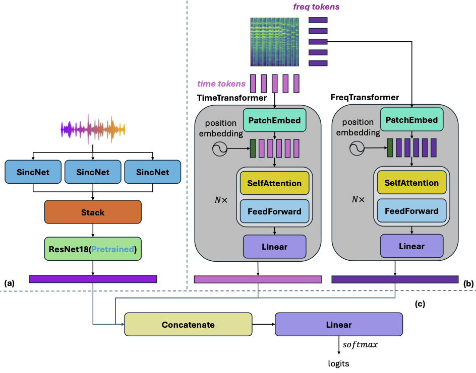

# GenreNet: Multi-objective Feature Fusion Network for Cantonese Opera Genre Classification


## Prepare Data
1. Split the original audio into 30s segments
```python
python scripts/processing.py -i input_dir -o output_dir -d duration -s resample_rate
```
`input_dir` is the audio folder to be processed, `output_dir` is the folder that saves processed audio, `duration` is the duration of each segment, default to 30(unit: seconds), `resample_rate` is the sample rate at which the audio is resampled.

2. Category balance
```python
python scripts/categorybalance.py -i main_dir -o exter_dir -n number  -m mode
```
Keep the number of files in `main_dir` as $n (n \geq 0)$ files or move $n (n < 0)$ files into `exter_dir`, `mode` specifies the method to select files to be saved or moved, which can be `random`, `first`, `last`, default to `random`.

## Train
```python
python train.py -m model_name -c config_file
```
`model_name` specifies the name of the model to be trained, default to `genrenet`. `config_file` specifies the config file that matches the model.

